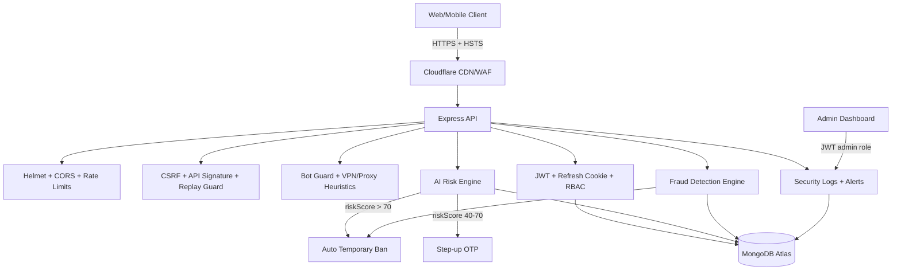

# Complete Security Architecture Diagram

## AI Risk Engine (Implemented)
- Inputs: failed login, device trust, IP mismatch, behavior anomalies, fraud signals.
- Output:
  - `>70` => block
  - `40-70` => OTP required
  - `<40` => normal

## Device Fingerprinting (Implemented)
- Fingerprint from user-agent + OS + browser hash.
- Stored in `knownDevices` + `trustedDevices` with trust score progression.

## Fraud Detection Starter (Implemented)
- Same card across users
- Same IP bulk usage
- Referral burst abuse
- Rapid cancellation / high-velocity booking
